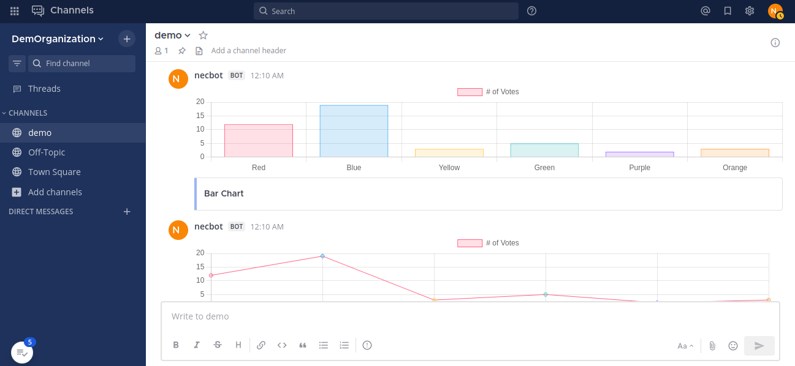

# ChartJS
mattermost chartjs plugin

# Mattermost Plugin

Welcome to the Mattermost Plugin! This plugin allows you to integrate external services with your Mattermost instance using incoming webhooks.

## Installation

To get started with this plugin, please follow these steps:

1. In your Mattermost instance, go to the **Product** menu, and select **Integrations** > **Incoming Webhook**.

   If you don't see the **Integrations** option, incoming webhooks may not be enabled on your Mattermost server or may be disabled for non-admins. They can be enabled by a System Admin from **System Console** > **Integrations** > **Integration Management**.

2. Select **Add Incoming Webhook** and provide a name and description for the webhook. The description can be up to 500 characters.

3. Choose the channel where you want to receive webhook payloads, then click **Add** to create the webhook. This action will generate a unique webhook endpoint URL.

   **Note:** Treat this endpoint as a secret. Anyone who has it will be able to post messages to your Mattermost instance.

## Testing the Plugin

To test the plugin, you'll need to send a payload to the webhook endpoint you created in the previous step. You can use HTTP POST requests to do this. Here's how:

1. Use the obtained webhook endpoint URL, which should look something like this: `https://your-mattermost-server.com/hooks/xxx-generatedkey-xxx`.

2. Send an HTTP POST request to the webhook endpoint with the payload. Below is an example of a sample payload sent from Postman:

   ```json
       {
  "response_type": "in_channel",
  "attachments": [
    {
      "color": "red",
      "title": "Pie Chart"
    }
  ],
  "props": {
    "chartdata": {
    "type": "Pie",
    "data": {
      "labels": ["Red", "Blue", "Yellow", "Green", "Purple", "Orange"],
      "datasets": [
        {
          "label": "# of Votes",
          "data": [12, 19, 3, 5, 2, 3],
          "backgroundColor": [
            "rgba(255, 99, 132, 0.2)",
            "rgba(54, 162, 235, 0.2)",
            "rgba(255, 206, 86, 0.2)",
            "rgba(75, 192, 192, 0.2)",
            "rgba(153, 102, 255, 0.2)",
            "rgba(255, 159, 64, 0.2)"
          ],
          "borderColor": [
            "rgba(255, 99, 132, 1)",
            "rgba(54, 162, 235, 1)",
            "rgba(255, 206, 86, 1)",
            "rgba(75, 192, 192, 1)",
            "rgba(153, 102, 255, 1)",
            "rgba(255, 159, 64, 1)"
          ],
          "borderWidth": 1
        }
      ]
    }
  }

}}
   

